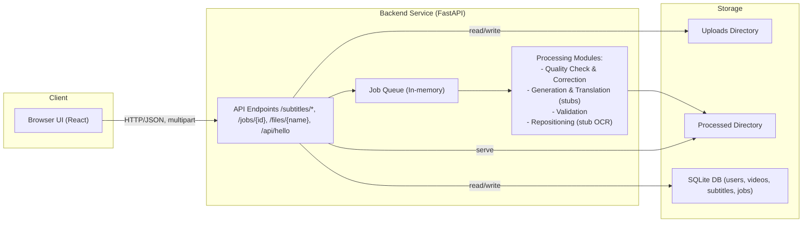

# Audio-Subtitle-Sync Platform - Detailed Project Description

## Executive Summary
The Audio-Subtitle-Sync platform is a fullstack application that streamlines subtitle–audio synchronization, automated subtitle generation, translation, validation, and quality assurance for video content. The current implementation provides a FastAPI backend exposing endpoints for quality checks, corrections, validation, generation, translations, and job status retrieval; a React-based frontend dashboard for uploads, progress tracking, and user interactions; and a SQLite-backed database schema for users, videos, subtitles, and jobs. The system emphasizes accessibility, compliance with OTT-style guidelines, and extensibility. This document describes the platform’s goals, current capabilities and constraints, architecture and container components, APIs, persistence model, security and compliance posture, asynchronous workflows, operational monitoring approach, UX/accessibility considerations, error handling, scalability and performance, deployment and environments, known risks, and future enhancements.

## Goals and Objectives
- Provide an AI-assisted pipeline to:
  1) Detect and correct subtitle timing, overlaps, and readability issues.
  2) Generate subtitles from videos and translate them into multiple languages.
  3) Validate subtitles against configurable OTT-reminiscent constraints such as line length, lines per caption, and timing windows.
- Offer a user-friendly dashboard to upload videos/subtitles, request processing, monitor job progress, and download results.
- Ensure a modular, extensible architecture that can evolve:
  - Replace stubbed components (OCR, STT/LLM, audio embeddings) with production-grade services.
  - Integrate robust authentication, authorization, logging, monitoring, and audit capabilities.
- Adhere to accessibility and quality standards, reinforcing a professional and inclusive user experience.

## Scope
- In scope (implemented):
  - Backend FastAPI service with endpoints for:
    - Quality check and correction (/subtitles/quality-check) with OTT-like constraints.
    - Subtitle generation from video (/subtitles/generate) with optional on-the-fly translation.
    - Translation of an existing subtitle (/subtitles/translate).
    - Validation of subtitles against parameters (/subtitles/validate).
    - Asynchronous job submission and polling (/jobs/{job_id}), processed file download (/files/{filename}), and a simple connectivity endpoint (/api/hello).
  - Subtitle correction, alignment, and OTT timing enforcement logic (pure functions) with language-agnostic normalization and robust token-level matching (subtitle_correction.py).
  - Deterministic stub implementations for generation, translation, validation, and repositioning (subtitle_processor.py, subtitle_reposition.py) suitable for CI.
  - In-memory job queue with background processing (job_processor.py).
  - React frontend that provides user flows for generation, correction, downloads, translation requests (UI elements), and basic progress tracking.
  - SQLite schema (users, videos, subtitles, jobs), initialization scripts, and models (schema.sql, models.py, init_db.py).

- Out of scope (planned/partially implemented placeholders):
  - Real OCR for burnt-in text detection (replace stub with RapidOCR or similar).
  - Real STT/LLM integrations for generation and translation.
  - Production-strength authentication and authorization (JWT/OAuth2 with RBAC).
  - Centralized logging, metrics, traceability, and alerting (e.g., ELK/Prometheus).
  - Database access APIs as a network service (current project uses SQLite locally via scripts, not an HTTP interface).

## User Personas and Roles
- Content Creator / Editor: Uploads video and subtitle files, runs generation and corrections, reviews and downloads outputs.
- Localization Specialist: Requests translations, verifies timing integrity and readability against style guides.
- Administrator: Oversees system health and job throughput, manages users and roles (future RBAC), audits logs (future).
- Compliance Officer: Reviews audit trails, ensures privacy and accessibility standards (planned enhancements).
- DevOps / Platform Engineer: Manages deployment, scaling, monitoring, and incident response (planned).

## Core Features
- Subtitle Quality Check & Correction:
  - Detects improper cue structure, long lines, too many lines per caption, and timing issues.
  - Aligns cues to transcript-like segments and enforces OTT-like timing constraints.
- Subtitle Generation and Translation:
  - Generates placeholder subtitles from a video (stubbed), then optionally creates translation variants.
- Validation:
  - Validates subtitle files against configurable parameters: characters per line, lines per caption, durations, reading speed, and optional frame rate/language hints.
- File Processing and Downloads:
  - Uploads and processing via asynchronous jobs with polling to retrieve results.
  - Download processed subtitle files.
- Subtitle Repositioning (Programmatic Utility):
  - Stubbed OCR detection drives top/bottom positioning hints (SRT/VTT/ASS/SSA) to avoid overlap with burnt-in text.

## Detailed Functional Requirements with User Stories
- Automated Upload and Detection of Subtitle-Audio Issues:
  - As a content manager, I upload a video and subtitle; the platform runs analysis and detects misalignment, overlap, and timing issues automatically.
- Automated Correction:
  - As a system, detect overlapping captions and conflicts; resolve automatically to improve readability and compliance.
- OTT-like Validation:
  - Validate reading speed, line length, max lines per caption, and durations; enforce corrections as needed.
- Export and Downloads:
  - Provide corrected and generated subtitle files for direct download.
- Programmatic API Access:
  - Expose endpoints to integrate with other systems, enabling upload, processing, and retrieval of results.
- Asynchronous Processing:
  - Queue long-running jobs, provide status polling, and return final artifacts upon completion.
- User Feedback:
  - Clear error messages and status indications in the dashboard (notifications and progress tracker).

Note: Items requiring real OCR, STT/LLM, RBAC/JWT, or centralized logging/metrics are planned but not fully implemented in this reference.

## Non-Functional Requirements
- Security and Privacy: Avoid hardcoding secrets, use environment variables (config.py). Plan JWT/OAuth2 with RBAC for production.
- Reliability and Fault Tolerance: Asynchronous job handling is implemented in-memory; migrate to persistent queues for production.
- Performance and Scalability: Support parallel processing via worker processes/containers; externalize artifacts to object storage for horizontal scale.
- Accessibility: UI aims for clear language and feedback; follow WCAG 2.1 AA principles in design and review.
- Maintainability: Modular Python modules with pure functions for core logic; documented endpoints and deterministic stubs facilitate CI stability.

## System Architecture Overview
The platform is designed as a multi-container application:
- React Frontend: Uploads files, monitors job status, fetches and downloads results.
- FastAPI Backend: Core processing engine (quality check, correction, generation, translation, validation) with job queue.
- SQLite Database: Stores users, videos, subtitles, and job metadata (local file-based in this implementation).



## Containerized Components
- Frontend Web Dashboard (React)
  - Local dev port (per project README): 3001.
  - Uses Axios with base URL from REACT_APP_API_BASE_URL.
  - Features: uploads, progress tracker, notifications, translation requests, login/register UI components (auth backend is not yet fully wired).
- Backend Service (FastAPI)
  - Default port: 8000 (configurable via BACKEND_PORT).
  - Endpoints: health, subtitles operations (quality-check, generate, translate, validate), jobs, file downloads, test endpoint.
  - Uses environment-driven configuration (see config.py).
- Database (SQLite)
  - File-based storage initialized via schema.sql and init_db.py.
  - Tables: users, videos, subtitles, jobs.
  - No standalone DB service port; direct file access via SQLite.

## APIs and Interfaces (OpenAPI excerpts)
Note: Security (JWT bearer) is not enforced in this reference implementation; below shows the intended security scheme for production. Current endpoints and signatures reflect main.py.

```json
{
  "openapi": "3.0.3",
  "info": {
    "title": "Subtitle Sync Platform - Backend Service",
    "version": "1.0.0",
    "description": "Endpoints for subtitle quality-check, generation, translation, validation, jobs, and file retrieval."
  },
  "components": {
    "securitySchemes": {
      "bearerAuth": { "type": "http", "scheme": "bearer", "bearerFormat": "JWT" }
    },
    "schemas": {
      "JobResponse": {
        "type": "object",
        "properties": {
          "job_id": { "type": "string" },
          "status": { "type": "string" }
        },
        "required": ["job_id", "status"]
      },
      "JobStatusResponse": {
        "type": "object",
        "properties": {
          "job_id": { "type": "string" },
          "status": { "type": "string" },
          "message": { "type": "string" },
          "result_files": { "type": "array", "items": { "type": "string" } }
        },
        "required": ["job_id", "status"]
      },
      "ValidationResponse": {
        "type": "object",
        "properties": {
          "valid": { "type": "boolean" },
          "issues": { "type": "array", "items": { "type": "string" } },
          "format": { "type": "string" }
        },
        "required": ["valid", "issues"]
      }
    }
  },
  "paths": {
    "/subtitles/quality-check": {
      "post": {
        "summary": "Run quality check and auto-correct a subtitle file",
        "responses": {
          "200": { "description": "Job queued", "content": { "application/json": { "schema": { "$ref": "#/components/schemas/JobResponse" } } } },
          "400": { "description": "Unsupported subtitle file extension" }
        }
      }
    },
    "/subtitles/generate": {
      "post": {
        "summary": "Generate subtitles from a video",
        "responses": {
          "200": { "description": "Job queued", "content": { "application/json": { "schema": { "$ref": "#/components/schemas/JobResponse" } } } }
        }
      }
    },
    "/subtitles/translate": {
      "post": {
        "summary": "Translate a subtitle file",
        "responses": {
          "200": { "description": "Job queued", "content": { "application/json": { "schema": { "$ref": "#/components/schemas/JobResponse" } } } }
        }
      }
    },
    "/subtitles/validate": {
      "post": {
        "summary": "Validate a subtitle file",
        "responses": {
          "200": { "description": "Validation result", "content": { "application/json": { "schema": { "$ref": "#/components/schemas/ValidationResponse" } } } },
          "400": { "description": "Unsupported subtitle file extension" }
        }
      }
    },
    "/jobs/{job_id}": {
      "get": {
        "summary": "Get job status",
        "parameters": [{ "name": "job_id", "in": "path", "required": true, "schema": { "type": "string" } }],
        "responses": {
          "200": { "description": "Job status", "content": { "application/json": { "schema": { "$ref": "#/components/schemas/JobStatusResponse" } } } },
          "404": { "description": "Job not found" }
        }
      }
    },
    "/files/{filename}": {
      "get": {
        "summary": "Download a processed file",
        "parameters": [{ "name": "filename", "in": "path", "required": true, "schema": { "type": "string" } }],
        "responses": { "200": { "description": "File response (text/plain)" }, "404": { "description": "File not found" } }
      }
    },
    "/api/hello": {
      "get": {
        "summary": "Connectivity test",
        "responses": { "200": { "description": "Returns {\"message\":\"hello\"}" } }
      }
    }
  }
}
```

## Data Model Overview and Persistence
The application uses a local SQLite database in this implementation. Schema (schema.sql, models.py):
- users: id, username (unique), password_hash, email, role.
- videos: id, user_id (FK), filename, upload_time, language, original (boolean).
- subtitles: id, video_id (FK), user_id (FK), filename, language, upload_time, processed (boolean), job_id (FK).
- jobs: id, user_id (FK), video_id (FK), subtitle_id (FK), job_type, status, result_url, created_at, completed_at.

Relationships:
- One user to many videos and subtitles.
- One video to many subtitles.
- Jobs may reference both video and subtitle entities to track processing lineage.

Persistence considerations:
- For production, consider migrating to a managed SQL database with SQLAlchemy ORM integration and migrations.
- Store large media and generated artifacts in object storage; persist metadata and URLs in the DB.

## Security, Privacy, and Compliance
- Current state:
  - No active JWT/OAuth2 enforcement; auth.py contains a placeholder dependency.
  - Environment variables are used for configuration (config.py). Secrets are not hardcoded.
  - CORS is configurable via environment; defaults allow all origins (tighten for production).
- Planned:
  - JWT/OAuth2 with RBAC; secure storage of credentials; password hashing; session and token management.
  - PII handling policies; encryption at rest/in transit; audit trails for access and changes.
  - Adherence to accessibility and OTT-related standards; data retention and deletion policies.

## Job Processing and Asynchronous Workflows
- The backend queues work using an in-memory job queue (job_processor.py). Each submission returns a job_id.
- Status is polled via GET /jobs/{job_id}. Upon completion, result_files lists processed artifacts.
- For production:
  - Replace in-memory queue with a persistent system (Redis/RQ or Celery) and separate worker processes.
  - Include job retries, backoff, and dead-letter queues for robust operations.
  - Emit events/notifications to the frontend via WebSocket or message bus for near-real-time updates.

## Monitoring, Logging, and Alerting
- Current:
  - Middleware adds X-Process-Time-ms header (middleware.py) for basic timing visibility.
  - Processing modules print diagnostic logs (alignment, OTT enforcement summaries).
- Planned:
  - Centralized logging (e.g., ELK or cloud logging), structured logs (JSON), correlation IDs.
  - Metrics (Prometheus) for API latency, queue depths, job throughput; Grafana dashboards.
  - Alerting rules for failures, timeouts, error rates, and resource saturation.

## Accessibility and UX Guidelines
- Use clear, concise language and descriptive feedback.
- Aim to meet WCAG 2.1 AA where feasible:
  - Provide sufficient contrast, keyboard navigation, and focus indicators.
  - Use ARIA labels where necessary, semantically correct HTML, and descriptive form inputs.
- Ensure forms validate and present actionable error messages. Prefer progress indicators for long-running tasks.
- Avoid motion or blinking elements that can trigger vestibular or seizure risks; provide reduced-motion modes if additions are made.

## Error Handling and User Feedback
- Frontend:
  - Notification and debug panels provide user-visible and developer-focused feedback.
  - Detailed error construction paths for correction/generation flows describe common HTTP and network issues.
- Backend:
  - Clear HTTP status codes and JSON error messages (400/404/413/422/500 paths).
  - Safety checks for invalid formats and missing resources.
- Future:
  - Error codes catalog; standardized problem+json responses; user-facing remediation guidance.

## Scalability and Performance Considerations
- Horizontal scalability:
  - Containerize services; scale backend workers for processing.
  - Move artifact storage to object storage to decouple from filesystem.
- Performance:
  - Offload heavy OCR/STT/LLM tasks to specialized workers.
  - Use streaming uploads/downloads for large files; chunked processing if needed.
- Caching:
  - Cache job status and metadata for faster UI updates.
- Backpressure:
  - Apply queue limits, rate limiting, and circuit breakers to protect core services.

## Extensibility and Maintainability
- Modular design:
  - Core alignment and correction logic in pure functions to ease testing and replacement.
- Replaceable providers:
  - STT/LLM provider hints are supported in request models (model_hint), allowing swaps without API changes.
- Config-driven behavior:
  - Environment variables drive CORS, directories, debug mode; easy to parameterize in deployments.
- Roadmap:
  - Introduce ORM, migrations, and repository layers for data access.
  - Introduce abstraction layers for OCR/STT/LLM to allow multiple providers.

## Deployment and Environments
- Backend (FastAPI):
  - Install dependencies from requirements.txt.
  - Run uvicorn main:app with configured BACKEND_HOST and BACKEND_PORT (default 8000).
  - Docs available at /docs.
- Frontend (React):
  - Set REACT_APP_API_BASE_URL in .env to point to backend base URL.
  - Development server typically runs on port 3001 (per current project README).
- Database (SQLite):
  - Initialize with Database/init_db.py and Database/schema.sql.
- Production considerations:
  - Use Docker Compose or Kubernetes; configure CORS appropriately.
  - Externalize data directories (uploads, processed) to persistent volumes.
  - Implement HTTPS termination and secure headers at ingress.

## Risks and Mitigations
- Risk: In-memory job queue loses state on restart.
  - Mitigation: Migrate to persistent queue (Redis/Celery) and externalized storage.
- Risk: Stub OCR/STT/LLM not suitable for production.
  - Mitigation: Integrate mature providers, add configuration and observability around them.
- Risk: Lack of authentication and RBAC.
  - Mitigation: Add JWT/OAuth2, roles, and enforce on routes plus secure token storage.
- Risk: Minimal logging/metrics.
  - Mitigation: Integrate centralized logging and metrics with dashboards and alerts.
- Risk: Local filesystem storage may not scale.
  - Mitigation: Migrate to shared object storage and CDN-backed downloads.

## Future Enhancements
- Full OCR pipeline to detect burnt-in regions (RapidOCR or equivalent) and frame sampling strategies.
- Production STT and LLM providers with language detection and model selection; high-quality translation engines.
- In-browser subtitle editor with synchronized playback and granular timing tools.
- Audit logging and compliance reports (exportable formats), including quality-check summaries and traceability.
- Admin dashboards for system status, logs, error reports, and metrics visualizations.
- WebSocket or SSE for real-time job updates; notifications via email/Slack.

## Glossary
- OTT: Over-The-Top media services; refers to streaming platforms and associated content standards.
- Cue: A single subtitle event with start time, end time, and text.
- SRT/ASS/SSA/VTT: Common subtitle file formats.
- OCR: Optical Character Recognition; used here to detect burnt-in (hardcoded) on-screen text.
- STT: Speech-to-Text; used to generate transcripts or base subtitles from audio.
- RBAC: Role-Based Access Control; restricts features based on user role.
- LLM: Large Language Model; used for text generation, translation, and language tasks.

---
Document status: This description reflects the current codebase in Subtitle_Sync_Platform. Where features are planned but not yet implemented, they are clearly labeled as intended future work.

Export note: To obtain a Word .docx, export this Markdown to .docx (e.g., via pandoc or your documentation pipeline) and save as Audio-Subtitle-Sync_Project_Description.docx in the same folder.
