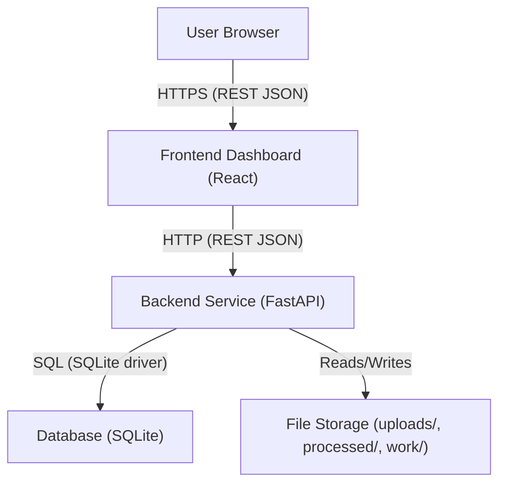

# Audio-Subtitle-Sync Platform - Project Overview

## Executive Summary
The Audio-Subtitle-Sync Platform is a fullstack application designed to make subtitle generation, correction, and quality assurance efficient and reliable. The backend service (FastAPI) provides core processing capabilities including subtitle quality checks and automated corrections, generation from video, translation, and validation against configurable rules. The frontend dashboard (React) offers a user-friendly workflow for uploading inputs, monitoring progress, downloading results, and receiving notifications. Data is persisted in SQLite with a schema for users, videos, subtitles, and jobs. While some capabilities are production-ready in concept, several are reference implementations or stubs to ensure deterministic behavior in CI and can be replaced later with integrations to STT/LLM providers, OCR for burnt-in text detection, and centralized logging/monitoring.

## Key Features
- Upload and file handling: Users can upload videos and subtitle files through the dashboard. The backend saves uploads to a configurable directory and returns processed outputs in a separate processed directory.
- Automated analysis and correction: The backend can perform validation and basic corrections such as whitespace normalization, separation of blocks, enforcement of per-caption line limits, and time adjustments to satisfy OTT-like constraints.
- Subtitle generation: Deterministic placeholder generation from a video (stub) returns a valid SRT suitable for CI testing.
- Translation: Deterministic placeholder translation appends language tags to text lines while preserving valid SRT structure.
- Validation: Checks include block structure integrity, presence of text, lines per caption limits, and maximum characters per line.
- Subtitle repositioning: Programmatic utility to reposition subtitles based on detection of hardcoded (burnt-in) text regions, with format-specific handling for SRT, VTT, ASS/SSA (OCR is stubbed for CI).
- Dashboard: React-based UI for uploads, job tracking, notifications, and file downloads.
- Notifications: In-app notifications and error feedback via a dedicated component.
- Role-based access control (RBAC): Database schema includes a user role field; platform-level RBAC is planned. Current backend routes do not yet enforce RBAC.
- In-browser editor: Planned; not implemented in this repository’s frontend at this time.

## Architecture Overview
The platform includes a React frontend, a FastAPI backend, and an SQLite database. The backend writes intermediate and final files to directories configured via environment variables (uploads, processed, work). CORS is enabled for frontend-backend communication, and an in-memory job queue provides non-blocking processing with status polling.



### Frontend (React)
- Routes and UI are centered around video/subtitle upload, job progress visualization, and notifications.
- Environment-driven API base URL; no hard-coded endpoints.
- Accessibility and responsiveness are incorporated through CSS and ARIA.

### Backend (FastAPI)
- Endpoints for health checks, subtitle quality check and correction, generation, translation, validation, job status querying, file retrieval, and a connectivity test.
- In-memory threaded job queue to simulate asynchronous job processing.

### Database (SQLite)
- Reference schema and initialization scripts support users, videos, subtitles, and jobs.
- Future integration with SQLAlchemy and additional tables (e.g., logs, audit trails) is planned.

## API Overview

### Implemented Backend API (FastAPI)
- GET /health
  - Returns basic service health and configuration details (e.g., directories and version).
- POST /subtitles/quality-check
  - Upload subtitle (and optional video) to run quality checks and apply corrections; returns a job_id for polling.
- POST /subtitles/generate
  - Upload a video to generate subtitles (stubbed deterministic SRT); supports optional generation language and translation request list; returns a job_id.
- POST /subtitles/translate
  - Upload a subtitle file and request translation into a target language; returns a job_id.
- POST /subtitles/validate
  - Upload a subtitle and validate according to provided parameters; returns validity and issues list immediately (synchronous).
- GET /jobs/{job_id}
  - Returns job status and result files array when completed.
- GET /files/{filename}
  - Returns the processed file by name from the processed directory.
- GET /docs/websocket
  - Clarifies that this reference service relies on polling; websockets are not currently implemented.
- GET /api/hello
  - Simple connectivity test endpoint used by the frontend.

Notes:
- The asynchronous endpoints return a job_id; clients should poll GET /jobs/{job_id}.
- The job queue is in-memory and non-durable; swap for Celery/RQ/Redis for production.

### Frontend Integration Endpoints in Repository (Planned vs Implemented)
The frontend service layer includes methods for endpoints such as /process, /subtitles (listing), /subtitles/{id}/download, /subtitles/{id}/translate, /auth/login, and /auth/register. These are not implemented in the FastAPI backend in this repository. The root README of this project also lists several endpoints as “Planned.” When integrating the dashboard, align the frontend’s service calls with the backend endpoints implemented above (or implement the planned endpoints on the backend).

Known integration gaps to address:
- Progress fields: frontend expects a progress value; current backend job status model returns status, message, and result_files only.
- Routes: frontend code references /jobs/{jobId}/status and other paths that do not exist in backend; current backend uses /jobs/{job_id}.

## Asynchronous Job Processing and Notifications
The backend uses an in-memory threaded JobQueue for non-blocking processing. Each enqueue returns a job_id; the job runner updates status to RUNNING and then COMPLETED or FAILED, along with any result file paths produced. The frontend polls the job status endpoint to update a visible progress tracker. Notifications are implemented in the frontend via a Notification component, providing contextual success and error messages. Email or external notifications are not implemented yet.

## Data Model Overview

### Implemented Tables (SQLite)
- users
  - id (PK), username (unique), password_hash, email, role
- videos
  - id (PK), user_id (FK), filename, upload_time, language, original
- subtitles
  - id (PK), video_id (FK), user_id (FK), filename, language, upload_time, processed, job_id (FK)
- jobs
  - id (PK), user_id (FK), video_id (FK), subtitle_id (FK), job_type, status, result_url, created_at, completed_at

This schema supports user accounts and roles, video and subtitle management, and job tracking. The current backend code uses local directories (uploads/, processed/, work/) for files; DB integration scaffolding is present but not actively exercised by routes in this repository.

### Planned Extensions
- Logs and audit trails: not yet implemented as tables in this repository but required for compliance and operational insights in production.
- ORM integration: future SQLAlchemy models and migrations for robust data access and evolution.

## Security
- Authentication/Authorization: Backend includes placeholder auth dependency; enforcement is not implemented. The database schema supports a role field for basic RBAC scoping once enforced by endpoints.
- JWT/OAuth2: Recommended for production; not yet implemented in the backend code here.
- Encryption in transit: Use HTTPS/TLS on ingress. The backend itself does not terminate TLS; rely on your gateway or reverse proxy.
- CORS: Configurable allowed origins via environment variables; enabled in the backend.
- Secrets management: Environment variables are used; avoid hardcoding sensitive values.

## Accessibility and Responsiveness
The dashboard UI incorporates:
- ARIA labels for interactive controls (e.g., close button in notifications).
- Reduced-motion, high-contrast, and dark-mode styles through CSS feature queries and media queries.
- Responsive layouts that adapt to small screens with adjusted spacing and typography.

These measures align with WCAG guidance for perceivable and operable interfaces.

## Monitoring and Logging
- Middleware adds an X-Process-Time-ms header to responses for basic performance insight.
- Processing modules emit structured console logs during quality check, alignment, and OTT constraint enforcement.
- Centralized logging, metrics collection, and alerting are planned for production (e.g., OpenTelemetry, ELK/EFK, or cloud-native equivalents).

## Compliance and OTT Standards
- Validation routines check for structural integrity, empty blocks, line counts per caption, and maximum characters per line.
- OTT-like timing constraints are enforced in the correction pipeline: minimum caption duration of approximately 0.8 seconds, maximum of 8 seconds, no overlaps, and order normalization.
- Hardcoded (burnt-in) text avoidance: A utility determines a safe placement (top/bottom) and updates formatting hints based on the subtitle format; OCR is currently stubbed for CI determinism.

## Deployment and Environment Variables
Backend (FastAPI):
- BACKEND_HOST (default: 0.0.0.0)
- BACKEND_PORT (default: 8000)
- DEBUG (default: false)
- CORS_ALLOW_ORIGINS (default: *)
- UPLOAD_DIR (default: ./uploads)
- PROCESSED_DIR (default: ./processed)
- WORK_DIR (default: ./work)
- LLM_PROVIDER (optional)
- LLM_API_KEY (optional)
- STT_PROVIDER (optional)
- STT_API_KEY (optional)

Frontend (React):
- REACT_APP_API_BASE_URL
- REACT_APP_SITE_URL

Note: .env files are not committed and may be empty by default. Provide the appropriate values for your environment before starting services.

## Getting Started

### Backend (FastAPI)
1. Change directory and install dependencies:
   ```
   cd Subtitle_Sync_Platform/BackendService
   pip install -r requirements.txt
   ```
2. Set environment variables (or rely on defaults).
3. Start the service:
   ```
   python start.py
   ```
4. Open the docs at:
   - http://localhost:8000/docs

### Frontend (React)
1. Install dependencies:
   ```
   cd Subtitle_Sync_Platform/FrontendWebDashboard
   npm install
   ```
2. Set environment variables in .env:
   ```
   REACT_APP_API_BASE_URL=<your backend url, e.g., http://localhost:8000>
   REACT_APP_SITE_URL=<your site url, e.g., http://localhost:3001>
   ```
3. Start the dev server:
   ```
   npm start
   ```

### Database (SQLite)
1. Initialize the schema (optional if you plan to wire up DB operations later):
   ```
   cd Subtitle_Sync_Platform/Database
   python init_db.py
   ```

## Roadmap and Future Work
- Align frontend service calls with backend endpoints (e.g., job status/paths, progress reporting).
- Implement authentication (JWT/OAuth2) and RBAC enforcement across all routes.
- Replace deterministic stubs with real integrations: STT for generation, LLM for translation and quality checks, and OCR for hardcoded text detection.
- Introduce a robust, durable job queue (e.g., Redis/Celery/RQ) and worker processes.
- Integrate SQLAlchemy models and migrations; implement CRUD endpoints for users, videos, and subtitles.
- Add logs and audit trails with secure, tamper-evident storage; integrate centralized logging and metrics.
- Implement a subtitle editor with video playback synchronization in the dashboard.
- Enhance compliance checks to include reading speed (CPS), frame rate/timecode validations, multi-language spell/grammar checks, and per-platform rule profiles.
- Containerization (Docker/Compose) and CI/CD pipelines.
- Accessibility testing and improvements toward strict WCAG conformance.

## Glossary
- LLM: Large Language Model used for translation and text quality improvements.
- STT: Speech-to-Text engine used to generate subtitles from audio/video.
- SRT/VTT/ASS/SSA: Common subtitle formats (SubRip/WebVTT/Advanced SubStation Alpha/SubStation Alpha).
- OTT: Over-the-Top media platforms; here, relates to subtitle standards such as timing and readability.
- RBAC: Role-Based Access Control, used to restrict features based on user roles.
- JWT: JSON Web Token, used to represent user identity and authorization claims.
- OCR: Optical Character Recognition; used here to detect burnt-in text in video frames for repositioning.
- CI: Continuous Integration; deterministic stubs provide consistent outcomes in automated builds.
