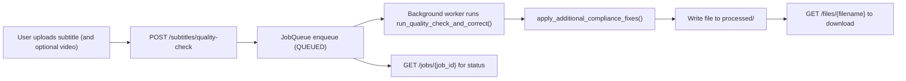

# Subtitle Correction Feature

## Overview
The Subtitle Correction feature automates the detection and remediation of common timing and readability issues in subtitle files. The primary goals are to fix misalignments, resolve overlaps, and apply basic compliance rules so that subtitles remain readable and suitable for OTT platforms. Where available or appropriate, the system can also reposition subtitles to avoid conflicts with burnt‑in (hardcoded) text regions and can run validations to highlight quality issues.

This feature is one of several in the platform, complementing:
- Subtitle generation from video,
- Subtitle translation,
- Validation and format checks.

In this repository, the automatic correction exposed via the API focuses on safe, deterministic normalization and basic timing/format repairs suitable for CI and development. More advanced alignment to a transcript and repositioning to avoid burnt‑in text are available via programmatic utilities.

## User Goals and Outcomes
Users want accurate, readable, time‑synced subtitles that pass basic OTT checks with minimal manual intervention. The correction workflow provides:
- A straightforward upload-and-fix path for existing subtitles.
- Automatic detection and repair of basic issues such as extra blank lines and excessive lines per cue.
- Job-based processing and a clear path to retrieve corrected files.
- Optional, programmatic utilities for advanced alignment and subtitle repositioning when required.

## Scope of Corrections
In this codebase, correction includes:
- Timing and block normalization:
  - Ensuring SRT block structure is well-formed (removing excessive blank lines).
  - Enforcing a maximum number of text lines per caption (default: two).
- Minimal overlap and duration normalization:
  - Simple guardrails to keep cue structure sane; advanced overlap and alignment logic exists in the algorithm module for programmatic usage.
- Burnt‑in text conflict mitigation:
  - A dedicated programmatic utility can reposition subtitles (top/bottom) to avoid persistent hardcoded text regions detected in the video.
- Basic readability checks:
  - Validation can detect excessive characters per line and missing text lines.
- Format‑preserving export:
  - For the repositioning utility, output retains the original format (SRT/ASS/SSA/VTT).
  - For the current correction API route, output is written as SRT for deterministic behavior.

## End-to-End Workflow
The end‑to‑end flow for API‑driven correction is:
1. A user provides a subtitle file, optionally with the corresponding video.
2. The backend enqueues a “quality check and correct” job.
3. The job normalizes the subtitle file and applies simple compliance rules. If a video is provided, a synthetic matching summary is logged to aid visibility during development.
4. The system writes the corrected file to the processed directory and applies a post‑processing hook for additional compliance formatting.
5. The user polls the job status and downloads the corrected file when ready.
6. The dashboard displays progress and completion notifications when integrated.

Mermaid overview:


## Backend Processing Pipeline
### Entry points and execution model
- FastAPI endpoints are defined in BackendService/main.py.
- Correction is submitted via POST /subtitles/quality-check. The service:
  - Saves uploaded files to UPLOAD_DIR.
  - Enqueues a background job in an in‑memory JobQueue (BackendService/job_processor.py).
  - Returns a job_id immediately.
- A background thread executes the job and writes output files into PROCESSED_DIR.

### Correction implementation
- The job calls run_quality_check_and_correct() in BackendService/subtitle_processor.py. Current behavior:
  - Normalizes line endings.
  - Removes excessive blank lines.
  - If a video file is provided, logs a synthetic “matching cues” summary to the console (deterministic, not frame/audio analyzed).
  - If enforce_ott is true, limits cues to two text lines per block (truncation for overlong blocks).
  - Writes an SRT file to processed/.

- A post‑processing hook apply_additional_compliance_fixes() (BackendService/subtitle_correction.py) copies the file, acting as an extension point for future formatting/quality controls without altering timestamps.

### Optional, advanced correction engine
- BackendService/subtitle_correction.py contains a robust, language‑agnostic algorithm for aligning subtitle cues to a Whisper‑like transcript, enforcing OTT timing constraints, and handling semantic equivalence and fuzzy spelling corrections.
- This engine is currently available programmatically (see tests in BackendService/tests/test_alignment_snap.py) and not wired into a public REST endpoint in this repository build.

### Repositioning to avoid burnt‑in text
- BackendService/subtitle_reposition.py exposes reposition_subtitles_based_on_hardcoded_text(video_path, subtitle_path, ...), which:
  - Analyzes the video (OCR stub for CI determinism) for persistent top/bottom hardcoded text.
  - Rewrites the subtitle with a safer position per format:
    - SRT: inserts “NOTE: position=top|bottom”.
    - VTT: adjusts cue settings (e.g., line:0 for top).
    - ASS/SSA: attempts style alignment changes; falls back to a note if not possible.
  - Writes back in the original format.

### Configuration and thresholds
- OTT-like safeguards in subtitle_correction.py (advanced engine) clamp cue durations to [0.8s, 8.0s] and remove overlaps; a final enforcement pass ensures cues do not exceed media end time.
- Validation defaults (POST /subtitles/validate) include:
  - max_chars_per_line: 42
  - max_lines_per_caption: 2
  - min_caption_duration_ms: 800
  - max_caption_duration_ms: 8000
  - reading_speed_cps: 17 (placeholder; not enforced in validate_subtitles at this time)

## Detection and Correction Techniques
### Format parsing and normalization
- Upload handling and simple format inference is implemented in BackendService/file_utils.py.
- The correction job currently reads raw text and normalizes structure. For multi‑format repositioning, the reposition utility preserves the original subtitle format.

### Timing and latency
- Current correction endpoint performs safe structural normalization rather than transcript‑based re‑timing.
- The advanced alignment engine (programmatic API) can:
  - Align cues to transcript segments using token overlap, sequence similarity, and contiguous runs.
  - Snap times to transcript span boundaries with optional within‑span refinement.
  - Generate missing cues from uncovered transcript segments.
  - Enforce OTT constraints (no overlaps, bounded durations).

### Overlap detection and gap insertion
- The advanced engine removes overlaps and maintains chronological order through dedicated enforcement logic.
- The quality‑check job applies basic structural fixes; comprehensive overlap logic lives in the advanced engine.

### Reading speed and line breaking
- Validation can flag overlong lines (characters per line). Reading speed (CPS) is present as an option but not currently enforced in the validate_subtitles implementation.

### Burnt‑in text conflict handling
- The reposition utility chooses top or bottom placement to avoid persistent hardcoded text regions inferred from video analysis. In this reference build, OCR is stubbed for determinism.

### Idempotency and versioning
- The original uploads are preserved under UPLOAD_DIR. Processed outputs are new files under PROCESSED_DIR.
- The advanced correction functions are pure (except the explicit post‑processing copy), enabling predictable versioning.

## APIs Used by the Frontend
This project exposes the following backend endpoints for the correction flow:
- POST /subtitles/quality-check
  - Form fields: subtitle_file (required), video_file (optional), language (optional), enforce_ott_compliance (bool, default true)
  - Returns: { job_id, status }
- GET /jobs/{job_id}
  - Returns job status and result file list when completed.
- GET /files/{filename}
  - Download a processed file by the name returned in job result_files.
- POST /subtitles/validate
  - Validate a subtitle with configurable options; returns issues if any.

Programmatic utilities (not REST in this repository build):
- reposition_subtitles_based_on_hardcoded_text(video_path, subtitle_path, ...)
- correct_subtitles(), correct_subtitles_with_audio(), hybrid_correct_subtitles() — for transcript-based alignment.

Note about current frontend service layer (Subtitle_Sync_Platform/FrontendWebDashboard/src/services/api.js):
- The helper functions currently call a placeholder POST /process and poll GET /jobs/${jobId}/status. These routes do not match the implemented backend. For a production hookup, the frontend should:
  - Call POST /subtitles/quality-check,
  - Poll GET /jobs/{job_id} (no /status suffix),
  - Download via GET /files/{filename}.

## Frontend UX Flow
The dashboard presents a simple correction workflow:
- Users select a video file and a subtitle file.
- On submit, the UI starts processing and displays progress or immediately triggers a download when a blob is returned.
- After job completion, users can download the corrected file.
- The UI also provides listing and download actions for available files (requires a compatible backend route).

To match the backend in this repo, the UI should switch to the job-based flow with the endpoints listed above. Presently, the React service stub uses a generic /process endpoint for demonstration.

## Data Models and Storage
A normalized schema exists under Subtitle_Sync_Platform/Database for users, videos, subtitles, and jobs (SQLite). In this repository build, the correction API uses an in‑memory job queue and writes processed files to the filesystem; database persistence is not wired to the job processor.

Tables (see Database/schema.sql and Database/models.py):
- users: id, username (unique), password_hash, email, role.
- videos: id, user_id, filename, upload_time, language, original.
- subtitles: id, video_id, user_id, filename, language, upload_time, processed, job_id.
- jobs: id, user_id, video_id, subtitle_id, job_type, status, result_url, created_at, completed_at.

## Quality and Compliance Checks
Quality checks available today include:
- Structural validation (POST /subtitles/validate): detects invalid blocks, missing text, overlong lines, and too many lines per caption.
- The correction job enforces a maximum of two lines per cue when enforce_ott_compliance is true.
- The advanced engine clamps cue durations to a configurable min/max range and removes overlaps, optionally snapping to transcript spans.

These checks are minimal and deterministic by design to ensure reproducible CI behavior. They can be extended in production with CPS calculations, re‑breaking, and language-aware polish.

## Security, Privacy, and Compliance
- CORS is configurable via environment (BackendService/config.py).
- Authentication helpers exist as placeholders (BackendService/auth.py); the current public endpoints do not enforce JWT or role‑based access in this repository build.
- Future production deployments should:
  - Protect endpoints with JWT and role-based access control.
  - Ensure TLS in transit and encryption at rest where applicable.
  - Maintain audit logs and retention/deletion policies (schema provides a place to persist job/file records).

## Operational Concerns (Async jobs, retries, timeouts)
- Asynchronous execution is implemented via an in‑memory JobQueue backed by background threads. This is suitable for demos and CI but not for production.
- There are no built‑in retries in the job runner. Failures are recorded in the in‑memory status with a message and stack trace.
- Frontend API calls use a 5‑minute timeout (src/services/api.js). Long operations should transition to job-based polling.
- For production, replace JobQueue with a durable queue (Celery/RQ with Redis or similar), add retries/backoff, and store job records in the database.

## Limitations and Edge Cases
- Severe de‑sync without reliable audio or transcript anchors may require manual review or the advanced engine with a high‑quality transcript.
- Heavily styled ASS with complex karaoke/effects may not be perfectly normalized by the reposition utility; it attempts Alignment changes and falls back to notes when necessary.
- Ambiguous encodings or malformed files may require user intervention; the current code reads files as UTF‑8 with ignore errors for robustness.
- The quality‑check endpoint writes SRT outputs for determinism, even if the input format differs. The reposition utility preserves the original format.

## Future Enhancements
- Integrate a production OCR (e.g., RapidOCR) for robust burnt‑in text region detection.
- Leverage phoneme‑level or CTC/DTW alignment models for improved audio-coupled timing refinement in the advanced engine.
- Implement accurate reading‑speed (CPS/CPM) enforcement and dynamic line breaking based on scene complexity and OTT profiles.
- Wire the advanced correction engine into a REST endpoint and optionally allow transcript upload for alignment.
- Persist job, video, and subtitle metadata in the database with audit logs and access controls.

## How to Validate Locally
1. Start the backend service:
   - Install dependencies:
     ```
     cd Subtitle_Sync_Platform/BackendService
     pip install -r requirements.txt
     ```
   - Run the service:
     ```
     python start.py
     ```
   - Open docs at http://localhost:8000/docs

2. Submit a correction job (replace file paths accordingly):
   - Using curl:
     ```
     curl -X POST "http://localhost:8000/subtitles/quality-check" \
       -F "subtitle_file=@Subtitle_Sync_Platform/assets/sample_subtitle.srt" \
       -F "enforce_ott_compliance=true"
     ```
   - Response:
     ```
     { "job_id": "...", "status": "QUEUED" }
     ```

3. Poll job status:
   ```
   curl "http://localhost:8000/jobs/<job_id>"
   ```
   - When completed, note the filename(s) in result_files.

4. Download the corrected file:
   ```
   curl -L -o corrected.srt "http://localhost:8000/files/<result_filename>"
   ```

5. Optional programmatic repositioning:
   - Run from the repo root (preserves format):
     ```
     python -m Subtitle_Sync_Platform.BackendService.subtitle_reposition --video input.mp4 --subs captions.ass --processed-dir ./Subtitle_Sync_Platform/BackendService/processed
     ```

6. Compare the original vs corrected files in a media player and review console logs for quality hints.

---
Notes on code-to-doc sync:
- The frontend service stub calls POST /process and GET /jobs/${jobId}/status, which are not implemented in the backend here. For a working integration, use POST /subtitles/quality-check, GET /jobs/{job_id}, and GET /files/{filename}.
