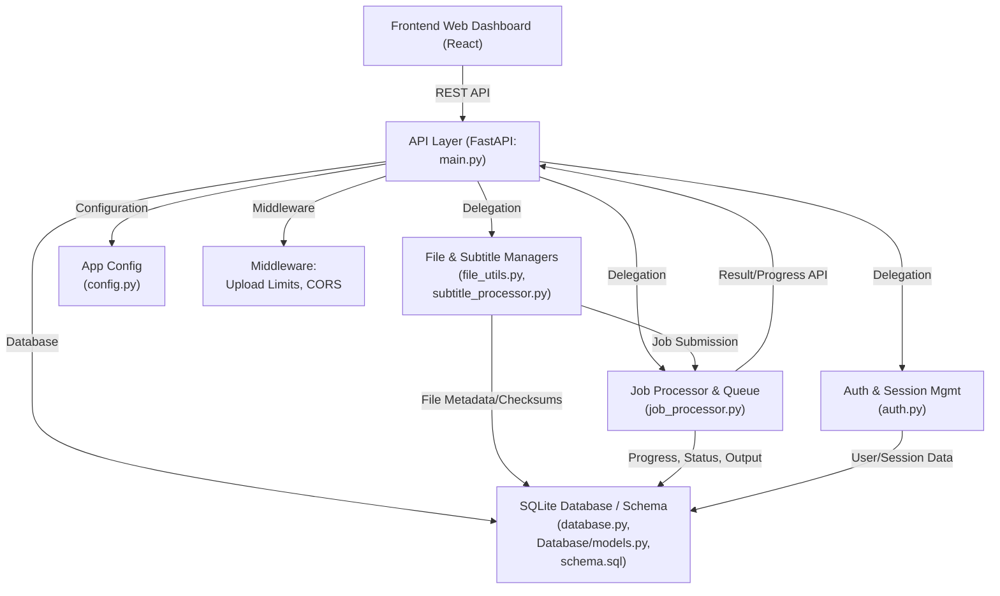

# Subtitle_Sync_Platform BackendService Documentation

## Overview

The BackendService container is the processing engine of the Subtitle_Sync_Platform. Built with FastAPI, it provides RESTful APIs for frontend users and external integrations, performs all business logic for subtitle-audio synchronization, subtitle validation, generation, correction, multi-language translation, compliance checking, and manages asynchronous job processing and audit logging. It tightly integrates with a dedicated SQLite database and supports high configurability, secure authentication, and scalable job-handling strategies.

## Overall Architecture

The BackendService is organized into several logical components and layers:

- **API Layer (main.py):** Defines all REST API endpoints, request validation, and response schemas, and registers middleware for upload handling and CORS.
- **Business Logic & Managers:** Core subtitle processing (subtitle_processor.py), file management (file_utils.py), authentication/session management (auth.py), configuration (config.py), and job queuing/processing (job_processor.py).
- **Database Integration (database.py):** All persistent data flows through the backend into the SQLite database, with schema management and queries abstracted by DatabaseManager.
- **Middleware (middleware.py):** Manages upload size limits, CORS headers, and ensures robust request validation.
- **Startup Handling (start.py):** Bootstraps application configuration, database initialization, startup/shutdown procedures, and ensures directory structure for uploads/processed files.

### Architecture Diagram

## Main Features and Responsibilities

- **Subtitle-Audio Synchronization:** Automatically aligns and corrects subtitle timing vs. video audio, detecting and resolving issues such as latency or overlap using advanced parsing and (optionally) LLM/AI-powered routines.
- **Subtitle Generation:** Uses AI models (and/or integration hooks to LLMs, OpenAI, Azure, etc. as found in config.py) to generate subtitles in the source language and additional target languages directly from video uploads.
- **Subtitle Validation:** Performs OTT-compliant checks to ensure pace, row/character count, overlap, and format compliance using `subtitle_processor.py`.
- **Format & Language Handling:** Detects and manages multiple subtitle formats (SRT, WebVTT, ASS, SSA, SCC), auto-parses, and supports multi-language translation.
- **Job Processing & Queuing:** Asynchronous jobs for correction, generation, translation, and validation are scheduled and tracked in `job_processor.py`, with status and progress queryable in real time by clients.
- **User Authentication/Authorization:** Robust password hashing, JWT-based access tokens, refresh tokens, role-based session management.
- **File Management:** Handles uploads, large file support (up to 2GB configurable), processed vs. uploaded directories, file validation, and cleanup.
- **Admin/Monitoring:** System statistics, audit logs, job status, workflow monitoring endpoints.
- **Security & Compliance:** CORS, configurable allowed origins, maximum file size enforcement, rate limiting, secure secret management, audit log capability.

## Key API Endpoints

Below is a summary of the most significant REST API endpoints, as defined in `main.py`:

- `POST /upload_video` – Upload a video file for processing. Accepts file and optional language; authenticates user.
- `POST /upload_subtitle` – Upload a subtitle file (with optional video association). Returns sanitized metadata.
- `POST /process_files` – Unified endpoint accepting a video and (optionally) subtitle for immediate correction or generation job submission. Supports translation target language.
- `GET /list_subtitles` – Lists available subtitle files with metadata, paging support.
- `POST /validate_subtitle` – Runs in-depth validation on a given subtitle and returns detailed results.
- `GET /job_status/{job_id}` – Query real-time processing status and outcome of jobs.
- `POST /register` – New user registration.
- `POST /login` – User authentication and JWT token issuance.
- `GET /me` – Gets current user information.
- `GET /admin/system_stats` – Provides system monitoring metrics.
- `GET /admin/audit_logs` – Returns audit logs for review and compliance.

API endpoints are organized with robust request/response schemas, with granular responses tailored for user-friendliness and error transparency.

## Integration Points

### Database

- **DatabaseManager (`database.py`)** abstracts all database operations; connections use the configured SQLite database (see `config.py`).
- Tables and relations are defined in `Database/models.py` and/or `Database/schema.sql`.
- All jobs, file records, user accounts, audit logs, and job results are persisted.
- The backend manages schema versioning and can initialize the database automatically at startup.

### Frontend

- Interacts exclusively via REST API (main.py).
- APIs provide JSON responses with detailed status, progress, errors, and download URLs for processed subtitle files.
- Event polling or real-time API queries for job progress.
- Multi-step workflows such as upload → validate/generate/correct → download are handled seamlessly.

### External Integrations

- Pluggable configuration for LLM/AI subtitle generation/translation (OpenAI, Azure Speech, Google Translate APIs in config.py).
- All external calls utilize securely stored API keys, retrieved from environment variables or .env file.

## Job Processing and Queues

- **JobProcessor (`job_processor.py`):** Handles background/asynchronous jobs for processes like correction, validation, generation, translation. Each job's state (PENDING, RUNNING, COMPLETED, FAILED, CANCELLED) is tracked in database and job objects.
- **Job Queues:** Each user request that involves a potentially long-running task (subtitle correction, generation, translation) is submitted as a job. The job processor manages concurrency via configuration (`max_concurrent_jobs`), supports progress tracking, cancellation, and returns output URLs.
- **Progress and Result Tracking:** Job status and progress can be queried via API, and subscribers/callbacks may be notified.
- **Resilience:** Handles restarts and ensures jobs either complete or roll back gracefully.

## Compliance and Security

- **Authentication:** JWT with short-lived access/longer refresh tokens; password hashes use salted SHA-256.
- **Authorization:** Role-based permission checks for protected/admin endpoints.
- **CORS:** Configurable allowed origins; all CORS headers handled by custom middleware.
- **File Validation:** Content- and extension-based validation for both video and subtitle files using magic bytes and heuristic checks.
- **Rate Limiting / Burst Control:** Configurable via `config.py` (rate_limit_per_minute/rate_limit_burst).
- **Sensitive Data:** API keys, database URIs, and secrets are loaded securely through config and never exposed.
- **Audit Trails:** Admin endpoints offer detailed logging and job history for review.

## Scaling Strategies

- **Configurable Concurrency:** `max_concurrent_jobs` allows operators to adjust job parallelism according to hardware.
- **Async IO & Workers:** Leverages FastAPI’s and the job processor’s async routines for optimal resource utilization.
- **Large File Upload Support:** Middleware and startup routines support files up to 2GB (configurable), ensuring bottlenecks do not develop for large video workflows.
- **Horizontal Scaling:** While focused on a single SQLite instance by default, the architecture is portable to Postgres or other RDBMS with minimal change. Job processor and service instances could be horizontally scaled with shared storage/backend refactoring.

## Third-party & Internal Dependencies

- **FastAPI, Starlette:** Core web framework and async runtime/middleware ecosystem.
- **Pydantic:** Data validation for configuration and API models.
- **jwt:** Secure token management.
- **Magic, mimetypes:** File content validation and type checking.
- **asyncio:** Background job orchestration and parallel task execution.
- **sqlite3:** Default persistence layer.
- **AI/LLM providers:** OpenAI, Azure, Google Translate supported via API keys if provided in configuration.

## Responsibilities Recap

- Central API for all platform workflows – upload, validation, correction, generation, download.
- Orchestrates all backend persistence, validation, AI-driven functionality and ensures compliance/security across workflows.
- Resiliently manages jobs and file handling, providing a robust, scalable foundation for the platform.

---

_Last updated: [automated]_  
_Sources:_  
- BackendService/config.py  
- BackendService/main.py  
- BackendService/file_utils.py  
- BackendService/auth.py  
- BackendService/job_processor.py  
- BackendService/database.py  
- BackendService/middleware.py  
- BackendService/start.py  
- BackendService/subtitle_processor.py  
